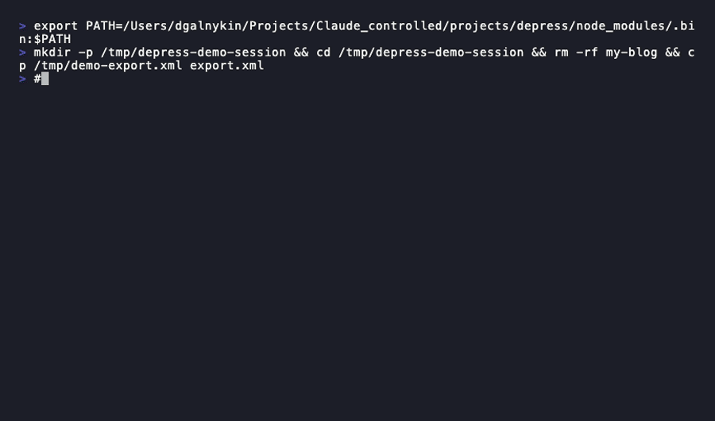

# depress 🦋

> *De-press yourself.* Migrate any WordPress blog to **Astro + Keystatic** in minutes. Free hosting forever.

[](https://npmjs.com/package/@depress-org/depress)
[](https://github.com/depress-org/depress/actions/workflows/ci.yml)
[](LICENSE)
[](https://npmjs.com/package/@depress-org/depress)
[](https://github.com/sponsors/bullwinkle)



## Why?

Your WordPress bill is depressing. Hosting a simple blog shouldn't cost $20–50/month.

`depress` converts your WordPress site to a **fully static site with a visual CMS** — deployed for free on Cloudflare Pages, with content stored in GitHub, and edited through a beautiful Keystatic admin panel.

```
WordPress (expensive)           Your new stack (free)
─────────────────────           ─────────────────────
MySQL database         →        Markdown files in Git
wp-content/uploads/    →        Cloudflare CDN
PHP + Apache           →        Static HTML (Astro build)
WP Admin               →        Keystatic visual editor
$20-50/month           →        $0/month. Forever.
```

## What gets migrated

- **All posts** — title, date, author, category, tags, excerpt, SEO meta (Yoast)
- **All pages** — including parent/child hierarchy
- **Navigation** — parsed from your WP menus, converted to working links
- **Media** — images downloaded and copied to `/public/media/`, links rewritten
- **Redirects** — `redirects.json` + `_redirects` (Netlify/Cloudflare format) with 301 entries for every old URL
- **Categories & tags** — with their own archive pages
- **Visual CMS** — Keystatic admin pre-wired to your content, no git knowledge needed
- **Complete Astro project** — pick a theme, run `npm install && npm run dev`, done

## Quick start

### Migrate from WordPress

```bash
# Put your export.xml in the current folder, then:
npx @depress-org/depress migrate

# Or specify paths explicitly:
npx @depress-org/depress migrate --input export.xml --wp-dir ./public_html --output ./my-blog
```

Then:

```bash
cd my-blog
npm start         # installs deps + starts dev server
# → http://localhost:4321          (your blog)
# → http://localhost:4321/keystatic  (CMS admin)
```

### Start a new blog from scratch

```bash
npx @depress-org/depress init
```

## Migration workflow

**Step 1** — Export your WordPress site:
- Go to `wp-admin → Tools → Export → All content → Download`
- (Optional) Download your WordPress `public_html` folder from hosting

**Step 2** — Run depress:
```bash
# With only the XML (images downloaded from your live site):
npx @depress-org/depress migrate --input export.xml

# With local WP folder (images served locally, faster + works offline):
npx @depress-org/depress migrate --input export.xml --wp-dir ./public_html
```

**Step 3** — Start your new blog:
```bash
cd output
npm start
```

**Step 4** — Deploy for free (pick one):

<details>
<summary>☁️ Cloudflare Pages <em>(recommended — fastest CDN, generous free tier)</em></summary>

1. Push your blog to a GitHub or GitLab repo
2. Go to [Cloudflare Pages](https://pages.cloudflare.com) → Create application → Connect to Git
3. Build command: `npm run build` · Output directory: `dist/`
4. In `keystatic.config.ts` switch to GitHub-backed CMS for production:
   ```ts
   export default config({
     storage: { kind: 'github', repo: 'your-org/your-repo' },
     // ...
   })
   ```

</details>

<details>
<summary>🐙 GitHub Pages</summary>

1. Push your blog to a GitHub repo
2. Create `.github/workflows/deploy.yml`:
   ```yaml
   name: Deploy to GitHub Pages
   on:
     push:
       branches: [main]
   jobs:
     deploy:
       runs-on: ubuntu-latest
       permissions:
         contents: read
         pages: write
         id-token: write
       steps:
         - uses: actions/checkout@v4
         - uses: actions/setup-node@v4
           with: { node-version: 20 }
         - run: npm ci && npm run build
         - uses: actions/upload-pages-artifact@v3
           with: { path: dist/ }
         - uses: actions/deploy-pages@v4
   ```
3. In repo Settings → Pages → Source: select **GitHub Actions**
4. Note: Keystatic CMS requires a server — on GitHub Pages use `kind: 'local'` for local editing only, or self-host the CMS separately.

</details>

<details>
<summary>🦊 GitLab Pages</summary>

1. Push your blog to a GitLab repo
2. Create `.gitlab-ci.yml` at the repo root:
   ```yaml
   pages:
     image: node:20
     script:
       - npm ci
       - npm run build
       - mv dist public
     artifacts:
       paths:
         - public
     only:
       - main
   ```
3. GitLab Pages serves from the `public/` directory — the `mv dist public` handles that.
4. Your blog will be live at `https://<username>.gitlab.io/<repo>` after the first pipeline completes.
5. Same CMS note as GitHub Pages: use `kind: 'local'` for local editing, or pair with Cloudflare Pages for full Keystatic support.

</details>

## Themes

depress ships two bundled themes — no download at migration time, fully tested:

| Theme | Stack | Best for |
|-------|-------|----------|
| `astrowind` *(default)* | Astro 5 + Tailwind CSS | Marketing sites, blogs, SaaS |
| `rocket` | Astro 6 + Tailwind CSS 4 | Personal blogs, portfolios |

```bash
npx @depress-org/depress migrate --theme astrowind   # default
npx @depress-org/depress migrate --theme rocket
```

## Options

```
depress migrate [options]

  -i, --input <path>    WordPress XML export file
  -d, --wp-dir <path>   WordPress public_html directory (for local media)
  --db <path>           WordPress MySQL dump (.sql) — enables Yoast SEO, ACF fields,
                        author profiles, and custom post type metadata
  -o, --output <path>   Output directory (default: ./output)
  -t, --theme <id>      Theme to use: astrowind (default) | rocket | scaffold

depress init            Create a new blank Astro + Keystatic blog (interactive)
```

### Getting the MySQL dump

In your WordPress hosting control panel (cPanel, Plesk, or any phpMyAdmin):

1. Go to **phpMyAdmin → your WordPress database → Export**
2. Choose **Custom**, select all `wp_` tables, format: **SQL**
3. Download the `.sql` file

Then run:

```bash
depress migrate --input export.xml --db wordpress-database.sql --output ./my-blog
```

This unlocks **Yoast SEO titles and descriptions** for all post types, **ACF custom fields**, and **full author profiles** — critical for large sites where the WXR export alone is incomplete.

## Output structure

```
output/
  src/
    content/
      articles/         ← migrated posts (Markdoc)
      pages/            ← migrated pages (Markdoc)
      categories/       ← category entries (YAML)
      tags/             ← tag entries (YAML)
    pages/
      index.astro       ← home page with latest articles
      blog/[slug].astro ← article pages
      category/[slug].astro ← category archive pages
      [...slug].astro   ← WP pages
    components/
    layouts/
    data/
      navigation.json   ← your WP menu, ready to use
  public/
    media/              ← all migrated images
  keystatic.config.ts   ← CMS config, pre-wired
  astro.config.mjs
  package.json          ← npm start just works
```

## Packages

| Package | Description |
|---------|-------------|
| [`@depress-org/depress`](https://npmjs.com/package/@depress-org/depress) | Main CLI |
| [`@depress-org/core`](https://npmjs.com/package/@depress-org/core) | Shared types |
| [`@depress-org/wp-migrate`](https://npmjs.com/package/@depress-org/wp-migrate) | Migration engine |

## Contributing

PRs welcome! This is a monorepo — see [CLAUDE.md](CLAUDE.md) for build commands and architecture notes.

Good first issues to tackle:
- [ ] `depress init` — interactive new-blog wizard (currently scaffolds a placeholder)
- [ ] `depress deploy` — Cloudflare Pages deploy automation
- [ ] Tests — there are none yet; vitest is the obvious choice
- [ ] `--db <path>` flag — parse a MySQL dump to extract ACF fields and full Yoast meta (see [ROADMAP.md](ROADMAP.md))

## Sponsoring

depress is free and open-source. If it saved you a WordPress hosting bill, consider sponsoring:

**[❤️ Sponsor on GitHub](https://github.com/sponsors/bullwinkle)**

## License

MIT © [depress-org](https://github.com/depress-org)
